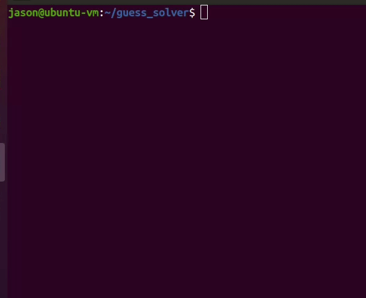
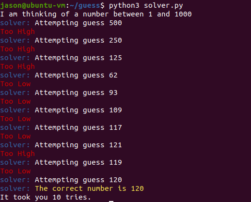

# Guess Solver

A simple guessing game script implemented in Python3 [pwntools
framework](https://github.com/Gallopsled/pwntools/).

## Installation

I've only tested this script on an Ubuntu 20.04 but theoretically, it should
work on any platform that has a Python3 interpreter and supports pwntools. 

Learn how to setup pwntools
[here](https://github.com/Gallopsled/pwntools/#installation):

### Install with git
```
git clone https://github.com/JasonTurley/guess_solver
cd guess_solver/
python3 solver.py
```

### Install with PowerShell

```
Invoke-WebRequest -Uri `
	https://raw.githubusercontent.com/JasonTurley/guess_solver/master/guessing_game.py `
	-OutFile .\guessing_game.py

Invoke-WebRequest -Uri ` 
	https://raw.githubusercontent.com/JasonTurley/guess_solver/master/solver.py `
	-OutFile .\solver.py

python3 solver.py
```

## Demo

The solver uses a [binary search algorithm](https://www.geeksforgeeks.org/binary-search/) 
to guess the correct number. 



<<<<<<< HEAD

=======


https://user-images.githubusercontent.com/31322646/125207993-82d49700-e255-11eb-88b4-a1b863c5308a.mp4
>>>>>>> a2b6bc57a640cc6dd7d4e7a07816153c366f6e69
